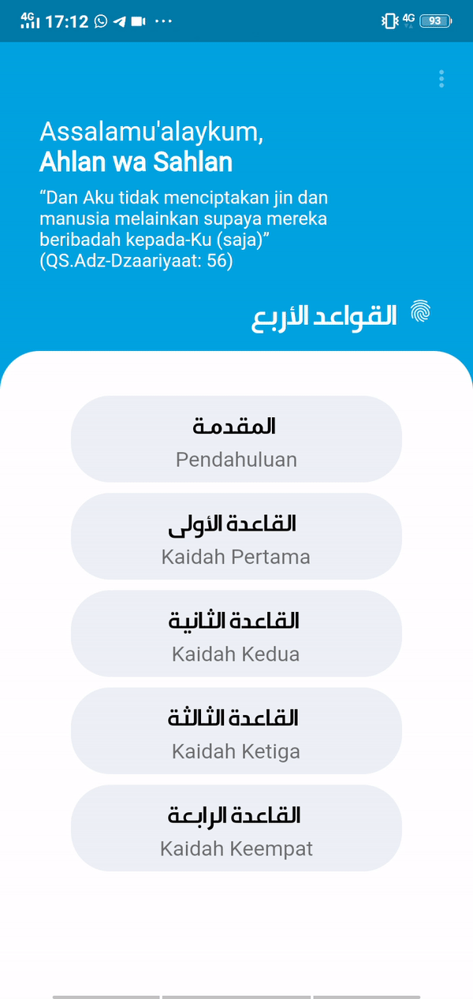
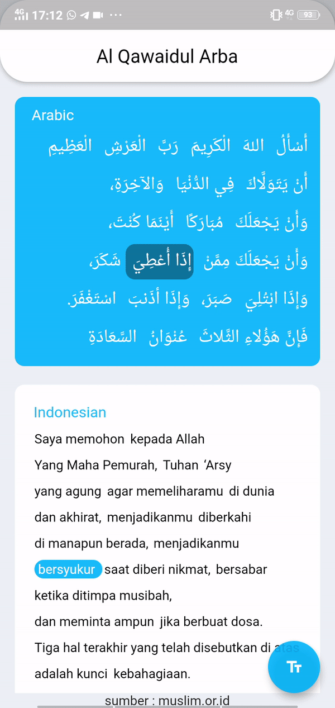

# Matn Al Qawaidul Arba 

A beautiful arabic book reader featured by word translation, 

## Features

### Word Tap Translation 
- Easily translate by tapping the arabic word.

### Touch Support
- Enjoy the best User Experience in Reading Quran by using Touch Gesture
### High Readability
- Adjustable font size to maximize your reading convenience

### Offline-user-first
- No need to access internet anymore to read the book, it's embedded in simple tsv data

### Simple Home Screen
- Simple and neat home screen UI

## Sources
- [Arabic Original Script](https://muslim.or.id/26784-matan-terjemah-al-qowaidul-arba.html) : Original Matn Script made by Ustadz Sa'id Abu Ukkasyah.
- [Indonesian Translation](https://muslim.or.id/26784-matan-terjemah-al-qowaidul-arba.html) : Authoritative and complete thorough bahasa translation of Matn by Ustadz Sa'id Abu Ukkasyah.
Nabil MRAD - Hamah, Syrian Arab Republic
- [Ara Hamah Kilania Font](https://arbfonts.com/ara-hamah-kilania-font-download.html) : " Stylish, modern, and neat arabic font " by Nabil MRAD

## License
This project is licensed under the MIT license, Copyright (c) 2020 hanifmuslim96. For more information see LICENSE.md.
